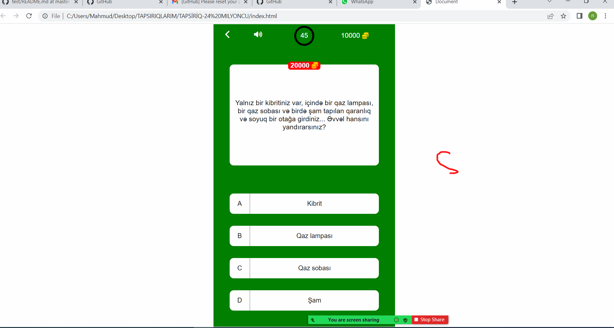

# GITHUB INDICATORS

  # Test

Hello, welcome to this lesson. Today I create with html and css Test.
## ## RULES OF USE

> *STEP-1:* `https://github.com/NurayAbbasova/test.git`  
> *STEP-2:*  enter the `Test` folder that appears  
> *STEP-3:*  open the folder you are in in a text editor  
> *STEP-4:*  open the folder with `cmd` or `Git Bash` and write `npm start`  
> *STEP-5:*  to download the project as `.zip`  [here](https://github.com/NurayAbbasova/test/archive/refs/heads/master.zip) click  

## Technology

This project was developed using the following technologies

| No | Technique | Purpose |
| - | ---------- | --------------------- |
| 1 | Html | Building a project skeleton |
| 2 | Css | Make-up of the established skeleton |
| 3 | VSCode | Text editor used in the project |

## SAMPLE SCREEN APPEARANCE

